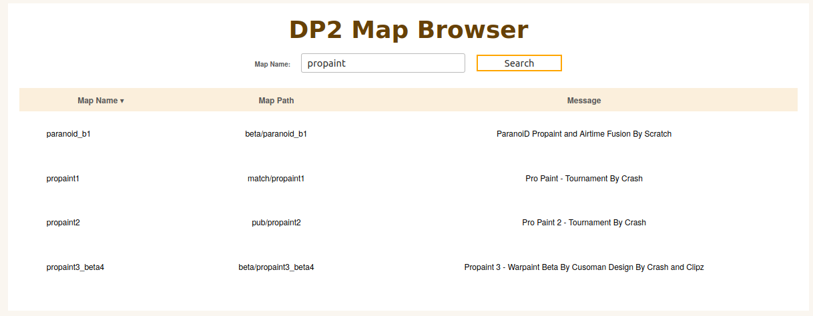
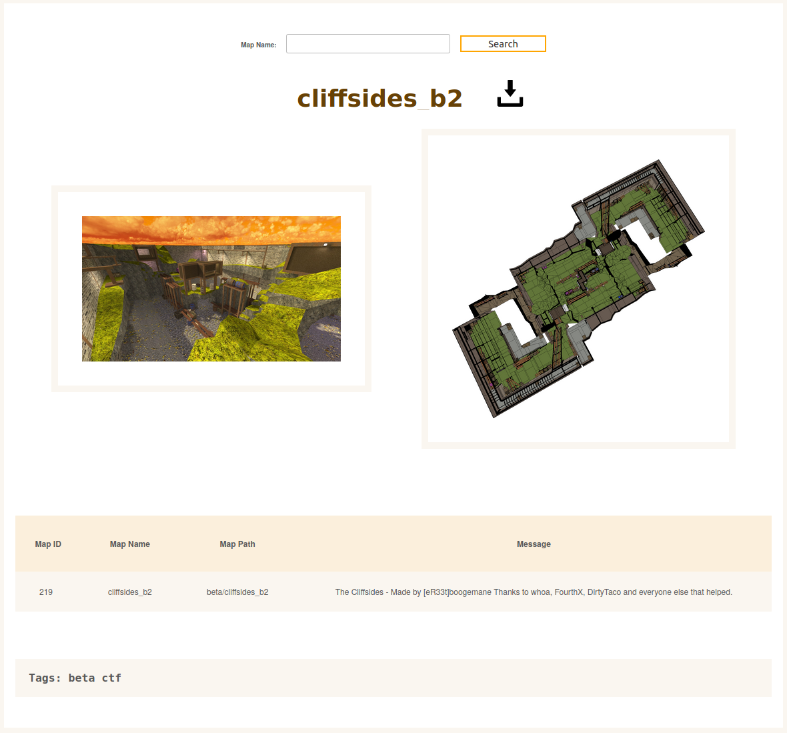

# Web frontend for SQLite database of DP2 maps
This website is currently hosted at http://whoa.ml/map_browser/index.php .

The map database is maintained using the 
MapSearch Discord bot https://github.com/aapokaapo/MapSearch/ .

## index.php
This file generates a list of maps stored in
sqlite_mapdata.db. This list can be sorted
and filtered using search bar. Clicking at a 
table row redirects so map_detail.php .

## map_detail.php
This file provides a download link for the map
file and displays an in-game screenshot of the
map as well as a top-down rendering of the map
generate using functionality from https://github.com/lennart-g/BSP-Hacking .
It also displays information from the database like
the loading message and tags that were added via
Discord.

