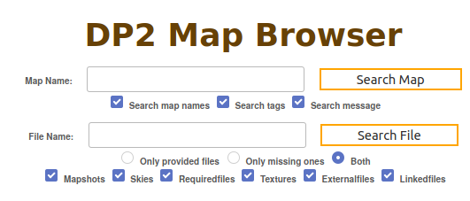
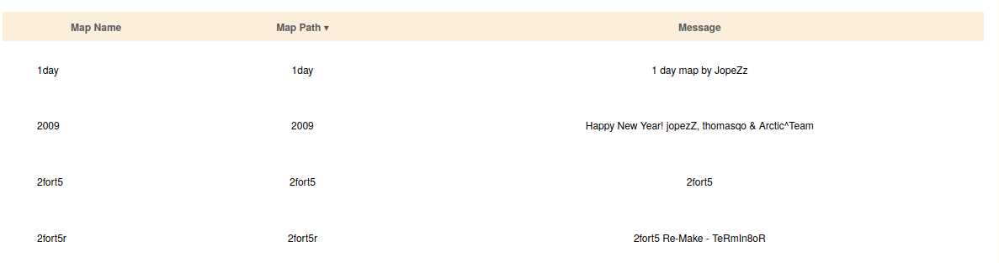
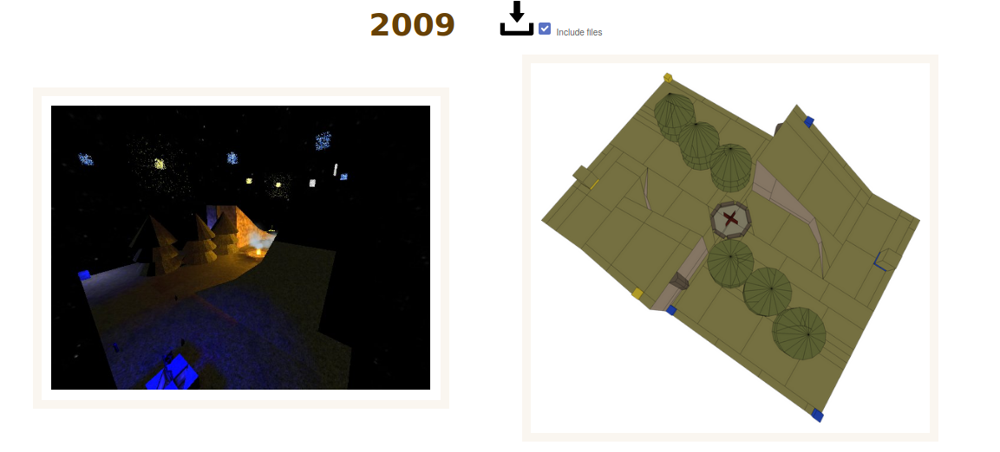
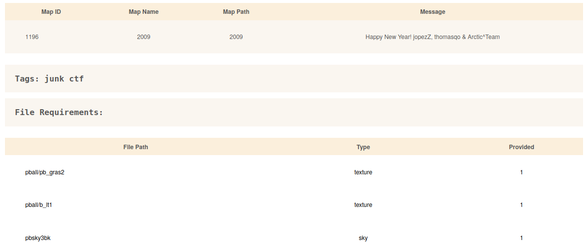
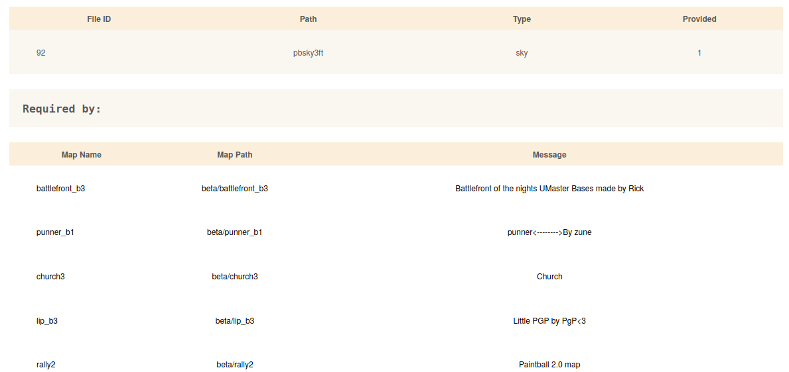
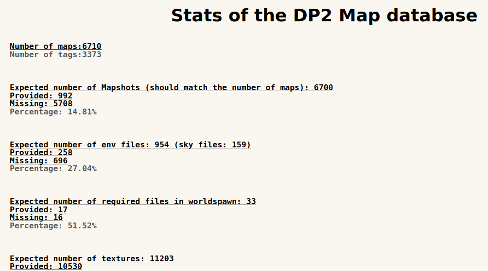

# Web frontend for SQLite database of Digital Paintball 2 maps

This website is currently hosted at http://whoa.ml/dpfiles/map_browser.php

The map database is maintained using the MapSearch Discord bot https://github.com/lennart-g/MapSearch

## Search bar

The website allows browsing DP2 maps and all their 
file requirements. Both allows searching for a string
as well is additional parameters.

In both cases, a list of database entries is returned.

## Map Detail
Clicking at an entry leads to a detail view

At the top, images of the map are shown.

The maps can be downloaded as a single file (Quake 2 .bsp)
or as a zip with all its file requirements (textures, models etc.).

Below that, additional map information as well as required
files are shown.

## File Detail
A similar structure applies to the file detail view.
Comparable to the map detail, maps requiring this file
are listed.

## Database status
Because Digital Paintball 2 evolved over more than 20 years,
many maps have been created for it. Since there has never been
a successful attempt to collect these files, many are missing
or at least not collected on a central server.

To support the growth of this database, a WIP status page
is provided:

